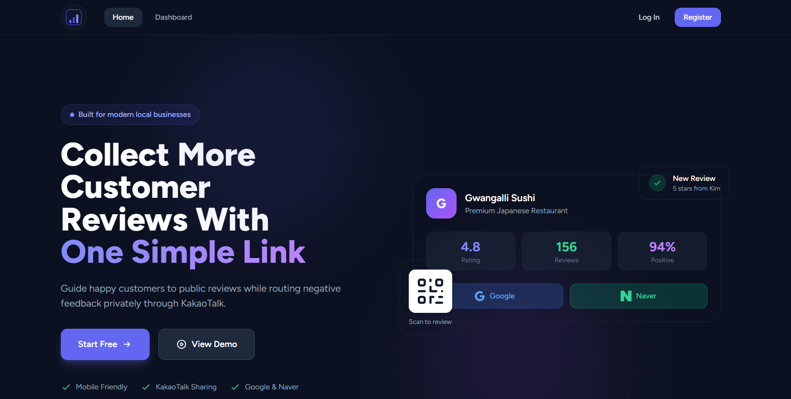
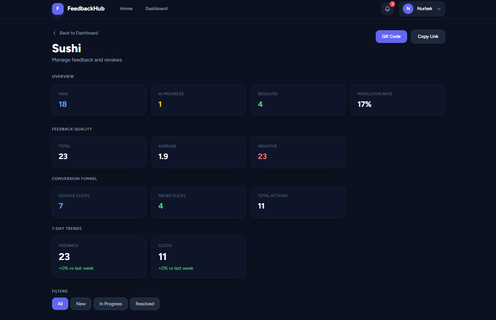

---

## 🔗 Live Demo

[Visit FeedbackHub](https://feedbackhub-3kpw.onrender.com)

---

# FeedbackHub

Modern customer feedback and review management platform built with Laravel.

FeedbackHub helps businesses collect customer feedback, manage reviews, and generate shareable review links through a clean and mobile-friendly dashboard.

---

## 🚀 Overview

FeedbackHub is a review management platform that helps businesses gather customer feedback, improve customer satisfaction, and grow their online reputation.

The platform uses a review funnel approach where customers first submit a rating through a dedicated feedback page. Based on the rating provided, customers are either encouraged to leave a public review or submit private feedback directly to the business.

This allows businesses to increase positive online reviews while identifying and resolving customer concerns before they become public.

---

## 🎯 Problem It Solves

Many businesses struggle to:

* Consistently collect customer feedback
* Encourage satisfied customers to leave online reviews
* Identify unhappy customers before they post negative reviews
* Manage reviews across multiple platforms
* Track customer satisfaction in a centralized system

FeedbackHub simplifies this process by providing a single platform for collecting, managing, and monitoring customer feedback.

---

## ⚙️ How FeedbackHub Works

### Business Registration

Business owners create an account and gain access to a personalized dashboard.

From the dashboard they can:

* Manage business information
* Create customer review pages
* Configure review destinations
* Monitor incoming feedback
* View customer ratings

---

### Creating a Business Profile

Businesses can create profiles that include:

* Business name
* Description
* Contact information
* Profile image
* Google review link
* Naver review link

Each business receives a dedicated public feedback page that can be shared with customers.

---

### Sharing Review Links

Business owners can distribute their feedback page using:

* QR codes
* SMS messages
* Email campaigns
* Social media
* Printed marketing materials
* Receipts and invoices

Customers can access the feedback page without creating an account.

---

### Customer Review Process

#### Step 1: Rating Experience

Customers visit the feedback page and provide a rating based on their experience.

The rating determines the next step in the review process.

---

#### Step 2: Positive Review Flow

If the customer provides a positive rating:

* A thank-you message is displayed
* The customer is encouraged to leave a public review
* The customer can choose their preferred review platform

Supported platforms include:

* Google Reviews
* Naver Reviews

This helps businesses increase their visibility and credibility online.

---

#### Step 3: Negative Review Flow

If the customer provides a lower rating:

* A private feedback form is displayed
* Customers can describe their concerns
* Feedback is sent directly to the business

This gives businesses an opportunity to understand and address customer issues privately.

---

### Notification System

Whenever new feedback is submitted:

* Business owners receive notifications
* Unread notifications are tracked
* Recent activity can be viewed from the dashboard

The notification system ensures businesses never miss important customer feedback.

---

### Dashboard Management

The dashboard serves as the central management area for business owners.

Users can:

* View recent feedback
* Read customer comments
* Monitor review activity
* Manage business profiles
* Update account information
* Track customer engagement

---

### Profile Management

Authenticated users can:

* Update personal information
* Change profile settings
* Manage profile pictures
* Maintain account security

---

## 🔒 Authentication & Security

FeedbackHub uses Laravel's authentication system to provide:

* Secure user registration
* User login and logout
* Protected dashboard access
* Authorization controls
* CSRF protection
* Secure session management

---

## 📱 Responsive Design

The application is fully responsive and optimized for:

* Desktop devices
* Tablets
* Mobile phones

The interface is built using Tailwind CSS and provides a consistent experience across all screen sizes.

---

## ✨ Features

### Business Management

* Create and manage businesses
* Update business information
* Upload business profile images
* Configure review destinations

### Review Collection

* Customer rating system
* Private feedback submission
* Public review redirection
* Review funnel workflow

### Review Platforms

* Google Reviews integration
* Naver Reviews integration

### Dashboard

* Review monitoring
* Feedback management
* Business overview
* Activity tracking

### Notifications

* New feedback notifications
* Unread notification tracking
* Real-time updates

### User Management

* Secure authentication
* Profile management
* Account settings

### User Experience

* Responsive design
* Modern interface
* Mobile-friendly layout
* Clean user workflow

---

## 🛠 Tech Stack

* Laravel
* Tailwind CSS
* Alpine.js
* MySQL
* Blade Components


## 📸 Screenshots

### Landing Page



---

### Businesses Page


---

### Dashboard




---

### Review Page


---

## 🚀 Installation

```bash
git clone https://github.com/Nurbekprodev/feedbackHub.git

cd feedbackhub

composer install

cp .env.example .env

php artisan key:generate

php artisan migrate

npm install

npm run build

php artisan serve
```

---

## ⚙️ Environment Setup

Configure your `.env` file:

```env
APP_NAME=FeedbackHub

DB_DATABASE=feedbackhub
DB_USERNAME=root
DB_PASSWORD=
```


## 📂 Project Structure

```text
resources/
├── views/
├── css/
└── js/

routes/
├── web.php

app/
├── Models/
├── Http/
└── Notifications/
```

---

## 📄 License

MIT License

```
